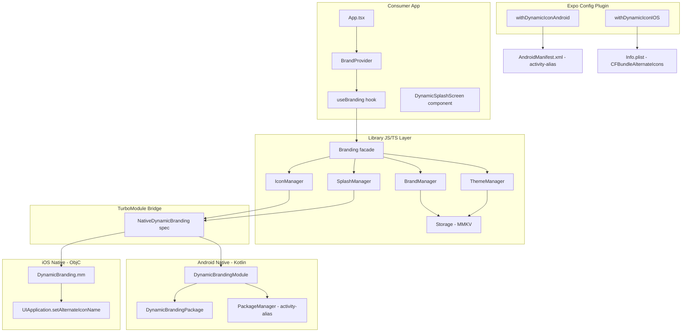

# Architecture & Design: @krishnavm/react-native-dynamic-app-icon

## 1. Overview

`@krishnavm/react-native-dynamic-app-icon` is a React Native New Architecture library that enables **full runtime branding** — app icon, splash screen, theme, and brand configuration — without an App Store release.

It bridges a **TypeScript API layer** to native code via a TurboModule, with encrypted MMKV persistence and an Expo Config Plugin for build-time setup.

---

## 2. Core Pillars

| Pillar | Implementation |
|---|---|
| **Performance** | Native icon switching via TurboModule — zero JS bridge serialisation overhead |
| **Resilience** | MMKV with lazy-init guard + in-memory fallback; corrupt-JSON guard on restore |
| **Type Safety** | Strict TypeScript throughout; `NativeDynamicBranding.ts` is the Codegen spec |
| **Modularity** | Separate managers for Icon, Splash, Brand, Theme — each independently testable |
| **New Architecture Ready** | `getTurboModule` wired on iOS; `ReactContextBaseJavaModule` on Android (interop mode) |
| **Expo Compatible** | Config plugin registers aliases/plist entries at prebuild time |

---

## 3. System Architecture



---

## 4. Data Flow: Icon Switch

```
useBranding.changeIcon('festival')
  └─→ Branding.changeIcon('festival')
        └─→ IconManager.changeIcon('festival')
              └─→ NativeDynamicBranding.changeIcon('festival')   ← TurboModule call
                    ├─ iOS: UIApplication.setAlternateIconName('festival')
                    └─ Android: PackageManager.setComponentEnabledSetting(
                                  ComponentName('...MainActivityfestival'),
                                  COMPONENT_ENABLED_STATE_ENABLED
                                )
```

---

## 5. Data Flow: Brand Restore on App Start

```
BrandProvider mounts
  └─→ Branding.initialize()
        ├─→ BrandManager.restoreBrand()
        │     └─→ Storage.getItem('@active_brand_config')
        │           └─→ MMKV.getString(...)  [or in-memory Map fallback]
        │                 └─→ JSON.parse(saved) → this.currentBrand
        └─→ ThemeManager.restoreTheme()
              └─→ Storage.getItem('@dynamic_branding_theme_mode')
                    └─→ this.currentMode = 'light' | 'dark' | 'auto'

BrandProvider.setState({ brand, theme, isInitialized: true })
  └─→ Consumer UI re-renders with restored state
```

---

## 6. Module Breakdown

### 6.1. `IconManager`
- **Delegates to**: `NativeDynamicBranding` TurboModule
- **iOS**: `DynamicBranding.mm` dispatches to `UIApplication.setAlternateIconName` on the main queue. Setting to `nil` restores the primary icon (`'Default'`).
- **Android**: `DynamicBrandingModule.kt` reads the currently-enabled `activity-alias` via `PackageManager.getPackageInfo(GET_ACTIVITIES | GET_DISABLED_COMPONENTS)`, disables it, and enables the target alias.

### 6.2. `SplashManager`
- **JS side**: Delegates to native (no-op stubs — splash is controlled by `DynamicSplashScreen` React component).
- **React component** (`DynamicSplashScreen.tsx`): Renders over `StyleSheet.absoluteFill` at `zIndex: 99999`. Animates out on `visible=false` via `Animated.timing`. Uses `useState` (not `._value`) to determine unmount.

### 6.3. `BrandManager`
- **Persistence**: Writes `BrandConfig` as JSON string to MMKV key `@active_brand_config`.
- **Remote fetch**: Plain `fetch()` call with optional headers → parsed as `BrandConfig`.
- **Asset download**: Uses `expo-file-system.downloadAsync` to cache assets in `{cacheDirectory}/dynamic-branding/`. Falls back to fetch+validate on non-Expo environments.
- **Corrupt JSON guard**: If stored value fails `JSON.parse`, it is cleared and a warning is logged.

### 6.4. `ThemeManager`
- Persists `ThemeMode` ('light' | 'dark' | 'auto') to MMKV key `@dynamic_branding_theme_mode`.
- `restoreTheme()` is called during `Branding.initialize()`.
- Note: does not subscribe to native system appearance changes yet — planned for v1.1.

### 6.5. `Storage`
- Lazily initialises MMKV inside a `try/catch` to avoid crashes in environments where MMKV is not natively linked (Expo Go, Jest).
- Falls back to an in-memory `Map<string, string>` — data is not persisted across restarts in this mode.

---

## 7. Expo Config Plugin

### Android — `withDynamicIconAndroid`
For each icon name in the `icons[]` array, injects into `AndroidManifest.xml`:
```xml
<activity-alias
  android:name=".MainActivityfestival"
  android:enabled="false"
  android:exported="false"
  android:icon="@drawable/festival"
  android:roundIcon="@drawable/festival"
  android:targetActivity=".MainActivity">
  <intent-filter>
    <action android:name="android.intent.action.MAIN" />
    <category android:name="android.intent.category.LAUNCHER" />
  </intent-filter>
</activity-alias>
```
> `android:exported="false"` is required on Android 12+ (API 31+) for components with intent-filters.

### iOS — `withDynamicIconIOS`
Injects into `Info.plist`:
```xml
<key>CFBundleIcons</key>
<dict>
  <key>CFBundleAlternateIcons</key>
  <dict>
    <key>festival</key>
    <dict>
      <key>CFBundleIconFiles</key>
      <array><string>festival</string></array>
      <key>UIPrerenderedIcon</key>
      <false/>
    </dict>
  </dict>
</dict>
```

---

## 8. Native Module — iOS

**`DynamicBranding.h`** — declares `NSObject <RCTBridgeModule>` (no `RCTEventEmitter` — this module emits no events).

**`DynamicBranding.mm`** — Objective-C++ bridge:
- Exports `changeIcon`, `restoreDefaultIcon`, `getCurrentIcon`, `showSplash`, `hideSplash`.
- All UIKit calls dispatched on `dispatch_get_main_queue()`.
- For `'Default'` icon name → passes `nil` to `setAlternateIconName` (restores primary).
- New Architecture: `getTurboModule` returns `NativeDynamicBrandingSpecJSI` (requires Codegen output from `pod install`).


---

## 9. Native Module — Android

**`DynamicBrandingModule.kt`**:
- Extends `ReactContextBaseJavaModule` (works in both Old and New Arch via RN 0.76 interop mode).
- `getCurrentIconSync()`: Calls `PackageManager.getPackageInfo(GET_ACTIVITIES | GET_DISABLED_COMPONENTS)`, iterates `ActivityInfo[]`, finds the alias whose `COMPONENT_ENABLED_STATE` is `ENABLED`.
- `changeIcon()`: Disables the currently-active alias (or real `MainActivity` when reverting to Default), enables the target alias.

**`DynamicBrandingPackage.kt`**: Standard `ReactPackage` registration returning `[DynamicBrandingModule]`.

---

## 10. Testing Strategy

| Layer | Approach |
|---|---|
| **JS Unit tests** | Jest + `babel.config.js` using `@react-native/babel-preset`. MMKV and TurboModule are manual mocks. |
| **TypeScript** | `tsc --noEmit` with `typeRoots` pinned to local `node_modules/@types` to avoid monorepo `@types/react` version conflicts. |
| **Integration** | Example app (`example/`) with all 4 icons and auto-holiday detection. |
| **Native (Android)** | Manual via `npx expo run:android`. Gradle 8.10.2 required (9.x breaks Kotlin compat). |
| **Native (iOS)** | Manual via `npx expo run:ios`. Requires physical device for alternate icon switching. |

---

## 11. Security & Performance

- **MMKV encryption**: Storage instance uses `encryptionKey: 'secure-branding-key'`. In production, this key should be derived from a device-unique source or fetched from a KMS.
- **HTTPS enforced**: `fetchRemoteBrand` throws on non-2xx responses. HTTP (non-TLS) URLs will be rejected by iOS ATS and Android Network Security Config by default.
- **Asset caching**: `downloadAssets` saves to `cacheDirectory` (not `documentDirectory`) — OS may evict these under storage pressure. Critical assets should be moved to `documentDirectory` by the consumer.
- **Startup performance**: `BrandProvider` calls `Branding.initialize()` async — consumers should gate their UI on `isInitialized` to avoid FOUC (flash of unstyled content).
